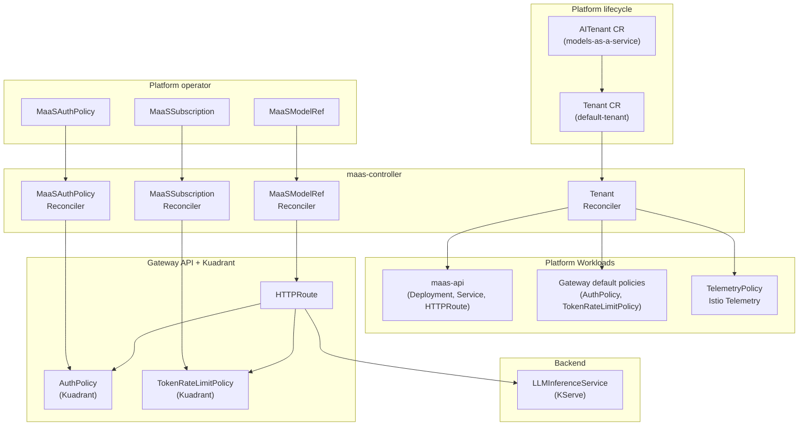
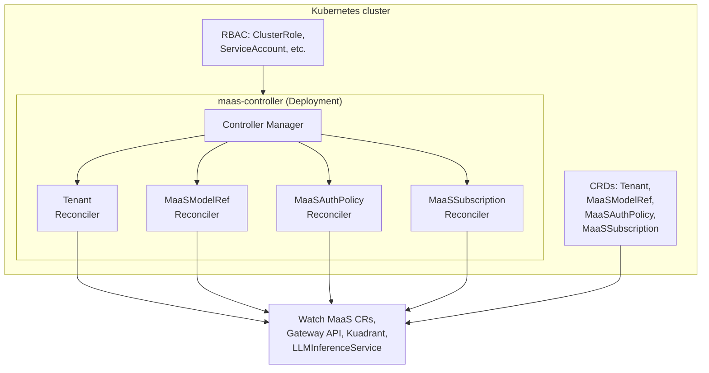
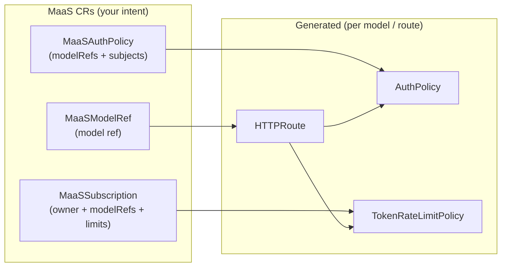
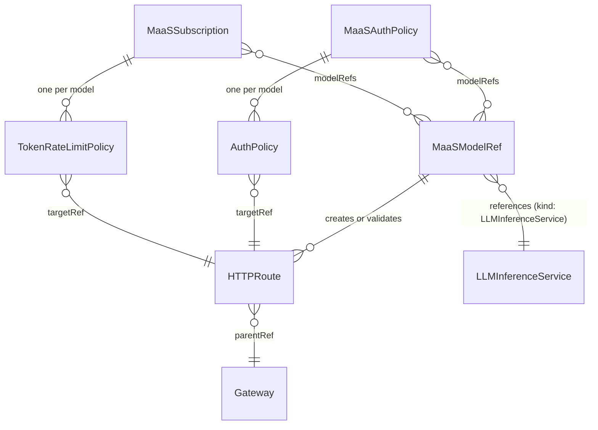

# MaaS Controller Architecture

This document provides a technical deep-dive into the MaaS Controller architecture, internal components, and resource model.

---

## What Is the MaaS Controller?

The **MaaS Controller** is a Kubernetes controller with two main responsibilities:

1. **Tenant reconciler** — deploys and manages the MaaS platform workloads (`maas-api`, gateway policies, telemetry, DestinationRule) via the **`Tenant`** CR (`maas.opendatahub.io/v1alpha1`). On startup the controller self-bootstraps `AITenant/models-as-a-service` in the `ai-tenants` namespace; the AITenant reconciler creates or adopts `Tenant/default-tenant` in the `models-as-a-service` namespace. The Tenant reconciler renders embedded kustomize manifests at runtime and applies them via Server-Side Apply (SSA).

2. **Subscription reconcilers** — let platform operators define:
    - **Which models** are exposed through MaaS (via **MaaSModelRef**).
    - **Who can access** those models (via **MaaSAuthPolicy**).
    - **Per-user/per-group token rate limits** for those models (via **MaaSSubscription**).

The controller does not run inference. It **reconciles** your high-level MaaS CRs into the underlying Gateway API and Kuadrant resources (HTTPRoutes, AuthPolicies, TokenRateLimitPolicies) that enforce routing, authentication, and rate limiting at the gateway.

---

## High-Level Architecture

**Summary:** The controller has two sides: the **Tenant reconciler** deploys and manages the MaaS platform workloads (maas-api, gateway policies, telemetry) from the `Tenant` CR; the **subscription reconcilers** turn MaaS CRs into Gateway/Kuadrant resources that attach to per-model HTTPRoutes and backends (e.g. KServe LLMInferenceService).

---

## Interaction with MaaS API (discovery)

The **MaaS API** is deployed as part of the **Tenant** platform bundle; it is not the same process as **maas-controller**, but the two work together: the controller **reconciles** **MaaSModelRef** and related CRs, and the API **lists** models from that cluster state for **GET /v1/models**.

For **GET /v1/models**, the MaaS API uses **MaaSModelRef** CRs as its primary source: it reads them cluster-wide (all namespaces), then **validates access** by probing each model's `/v1/models` endpoint with the client's **Authorization** header (passed through as-is). Only models that return 2xx or 405 are included. The catalogue returned to the client is the set of MaaSModelRef objects the controller reconciles, filtered to those the client can access. **No** token exchange is performed; the header is forwarded as-is.

!!! warning "Trust boundary: model discovery"
    The GET /v1/models flow forwards raw **Authorization** headers to model workloads during access validation. That creates a trust boundary:
    - **Model workloads must not log or forward raw Authorization headers** during discovery probes
    - **Operators should only register models trusted to handle credentials safely** via MaaSModelRef
    - For additional protections on model inference routes, see [Authentication Internals](./authentication-internals.md)
    - Future enhancements may include token exchange or credential mediation to reduce exposure during discovery

For end-user behavior and examples, see [Model Discovery](../user-guide/model-discovery.md) and [Model listing flow](../configuration-and-management/model-listing-flow.md).

---

## Component Diagram (Controller Internals)

- Single binary: **manager** runs four reconcilers (Tenant + three subscription reconcilers).
- Registers **Kubernetes core**, **Gateway API**, **KServe (v1alpha1)**, and **MaaS (v1alpha1)** schemes; uses **unstructured** for Kuadrant resources.
- Reads/writes MaaS CRs, HTTPRoutes, Gateways, AuthPolicies, TokenRateLimitPolicies, and LLMInferenceServices (read-only for model metadata/routes).

---

## What the Controller Creates (Runtime View)

| Your resource   | Controller creates / uses                                      |
|-----------------|-----------------------------------------------------------------|
| **MaaSModelRef**   | **HTTPRoute** (or validates KServe-created route for LLMInferenceService)  |
| **MaaSAuthPolicy** | One **AuthPolicy** per referenced model; targets that model's HTTPRoute |
| **MaaSSubscription** | One **TokenRateLimitPolicy** per referenced model; targets that model's HTTPRoute |

All generated resources are labeled `app.kubernetes.io/managed-by: maas-controller`.

---

## Data Model (Simplified)

- **MaaSModelRef**: `spec.modelRef.kind` = LLMInferenceService or ExternalModel; `spec.modelRef.name` = name of the referenced model resource.
- **MaaSAuthPolicy**: `spec.modelRefs` (list of ModelRef objects with name and namespace), `spec.subjects` (groups, users).
- **MaaSSubscription**: `spec.owner` (groups, users), `spec.modelRefs` (list of ModelSubscriptionRef objects with name, namespace, and required `tokenRateLimits` array to define per-model rate limits).

---

## References

### Other internals (this guide)

- [Reconciliation Flow](./reconciliation-flow.md) — Ownership, watches, status, deletion lifecycle
- [Authentication Internals](./authentication-internals.md) — Subscription selection, TRLP keys, identity context

### Install and operations

- [MaaS Setup](../install/maas-setup.md) — Platform install, **Tenant** CR, gateway
- [Validation](../install/validation.md) — Post-install checks
- [Troubleshooting](../install/troubleshooting.md) — Common failures
- [Access and Quota Overview](../concepts/subscription-overview.md) — Subscriptions and access model
- [Quota and Access Configuration](../configuration-and-management/quota-and-access-configuration.md) — Quotas, auth policies, subscriptions

### Discovery and API

- [Model Discovery](../user-guide/model-discovery.md) — Using **GET /v1/models** from a client perspective
- [Inference](../user-guide/inference.md) — Calling inference endpoints
- [Model Listing Flow](../configuration-and-management/model-listing-flow.md) — How listing fits the platform
- [MaaS API Overview](../reference/maas-api-overview.md) — REST surface (discovery, keys, admin)

### Architecture context

- [Architecture](../concepts/architecture.md) — Product-level architecture (Concepts)
