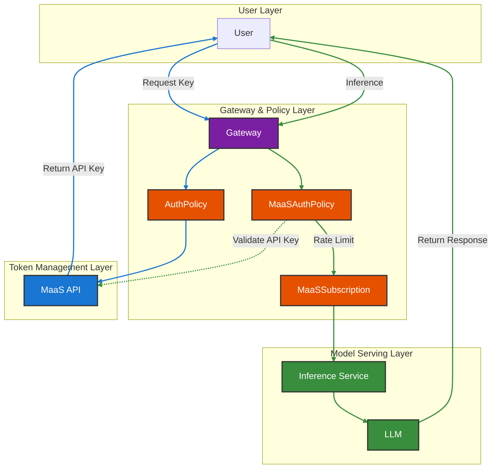
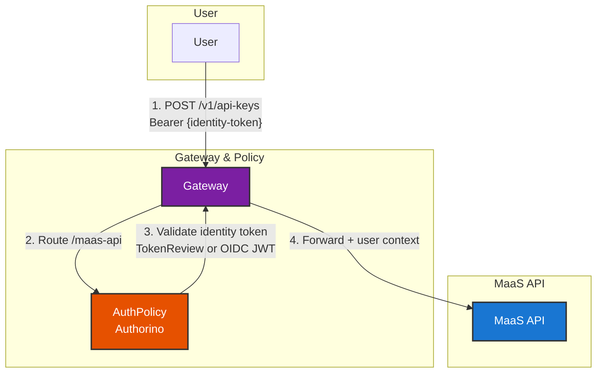
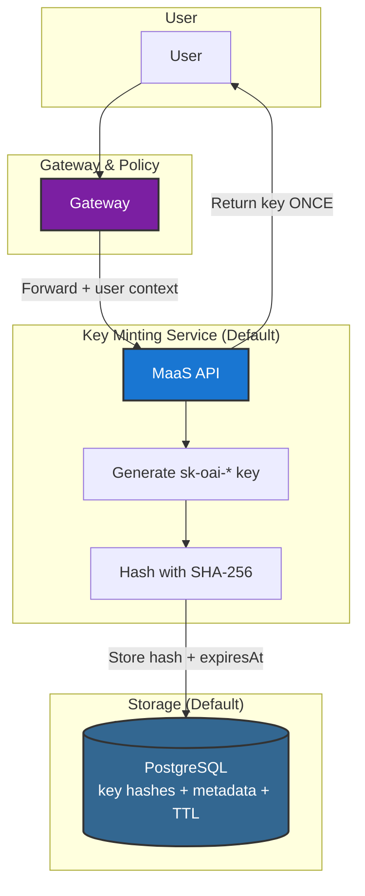
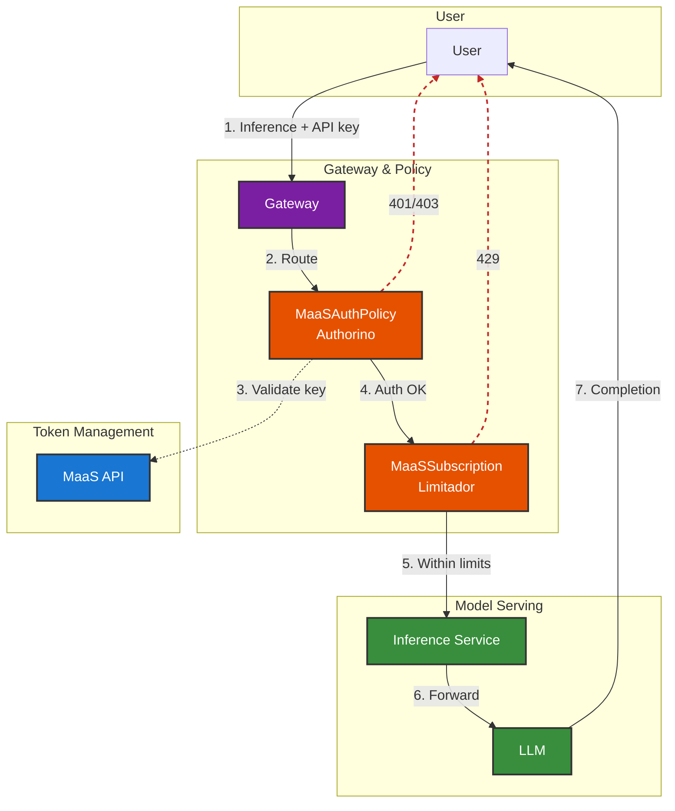
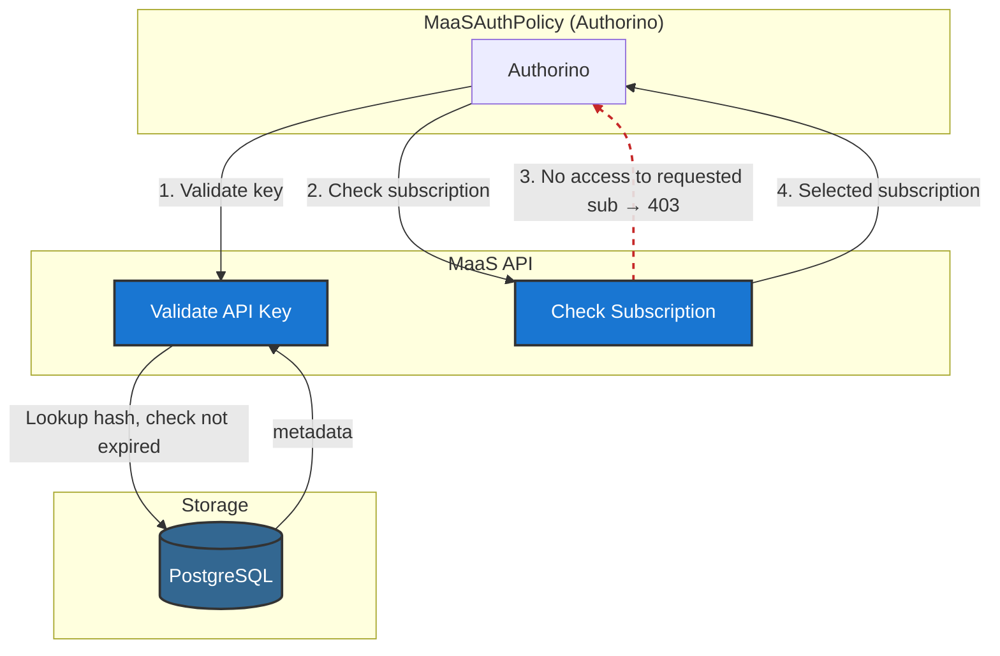
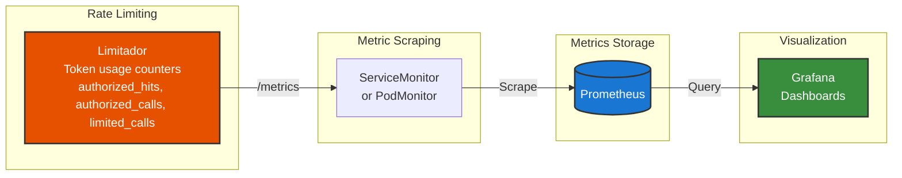
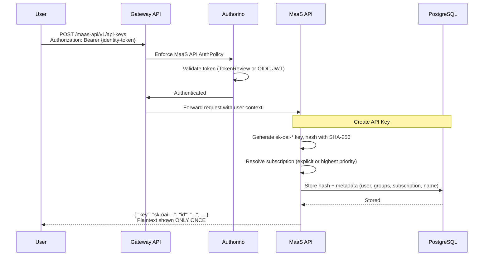
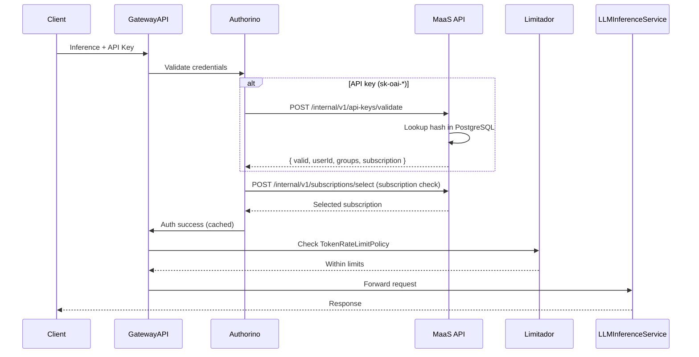

# MaaS Platform Architecture

## Overview

The MaaS Platform is a Kubernetes-native layer for AI model serving built on [Gateway API](https://gateway-api.sigs.k8s.io/) and policy controllers ([Kuadrant](https://docs.kuadrant.io/), [Authorino](https://docs.kuadrant.io/1.0.x/authorino/), [Limitador](https://docs.kuadrant.io/1.0.x/limitador/)). It provides policy-based authentication and authorization, plus subscription-based rate limiting. Future work includes improved request routing and discovery.

## Architecture

### 🏗️ High-Level Architecture

The MaaS Platform is an end-to-end solution built on [Kuadrant](https://docs.kuadrant.io/).

All traffic flows through the Gateway    **maas-default-gateway** (Gateway API). Then utilizes [Authorino](https://docs.kuadrant.io/1.0.x/authorino/) to enforcing authentication, authorization and [Limitador](https://docs.kuadrant.io/1.0.x/limitador/) to enforce and track token usage. Auth policies use **caching** (e.g., subscription selection results, API key validation) to reduce latency on the hot path.

**Main Flows:**

- **Key Minting** — For obtaining API keys to authenticate programmatic access. 
- **Inference** — For calling models to generate completions.

### Key Minting Flow — Request & Validation

**Flow summary:**

1. User sends `POST /v1/api-keys` with Bearer `{identity-token}`.
2. Gateway routes the request to AuthPolicy (Authorino).
3. AuthPolicy validates the presented identity token via the configured auth method (`kubernetesTokenReview` for OpenShift, or OIDC JWT validation when enabled).
4. Gateway forwards the authenticated request and user context to the Key Minting Service.

!!! Tip "OIDC Support"
    The `maas-api` route can be configured to validate external OIDC tokens (for example Keycloak-issued JWTs) in addition to the existing OpenShift TokenReview flow. Model routes still use the current API-key policy, so the interim OIDC flow is: authenticate with OIDC at `maas-api`, mint an `sk-oai-*` key, then use that key for model discovery and inference.

### Key Minting Service (Default Implementation)

**Flow summary:**

1. Gateway forwards the authenticated request and user context to the Key Minting Service (MaaS API).
2. The service generates a random `sk-oai-*` key and hashes it with SHA-256.
3. Only the hash and metadata (username, groups, name, optional `expiresAt` when TTL is set) are stored in PostgreSQL.
4. The plaintext key is returned to the user **once**, along with `expiresAt` when a TTL was specified; the key cannot be retrieved again.

Keys can be permanent (no expiration) or have an optional **TTL** (`expiresIn`, e.g., `30d`, `90d`, `1h`); the response includes `expiresAt` when a TTL is set.

!!! tip "Future Plans"
    This is the **default implementation**. Future plans include integration with other key store providers (e.g., HashiCorp Vault, cloud secret managers).

!!! note "PostgreSQL"
    A **PostgreSQL database is required** and is **not included** with the MaaS deployment. The deploy script provides a basic PostgreSQL deployment for development and testing—**this is not intended for production use**. For production, provision and configure your own PostgreSQL instance.

### Inference Flow — Through MaaS Objects

**Flow summary:**

1. User sends inference request with an API key.
2. Gateway routes to MaaSAuthPolicy (Authorino).
3. MaaSAuthPolicy validates the key via MaaS API and selects subscription; on failure returns 401/403.
4. MaaSSubscription (Limitador) checks token rate limits; on exceed returns 429.
5. Request reaches Inference Service and LLM; completion returned to user.

### Auth & Validation Flow (Deep Dive)

The MaaSAuthPolicy delegates to the MaaS API for key validation and subscription selection. The subscription name comes from the PostgreSQL key record (set at key creation).

**Flow summary:**

1. Authorino calls MaaS API to validate the API key.
2. MaaS API validates the key (format, not revoked, not expired) and returns username, groups, and subscription.
3. Authorino calls MaaS API to check subscription (groups, username, requested subscription from the key).
4. If the user lacks access to the requested subscription → error (403).
5. On success, returns selected subscription; Authorino caches the result (e.g., 60s TTL). Identity information (username, groups, subscription, key ID) is made available to TokenRateLimitPolicy and observability through AuthPolicy's `filters.identity` mechanism, but is **not forwarded** as HTTP headers to upstream model workloads (defense-in-depth security). Clients do not send subscription headers on inference; subscription comes from the API key record created at mint time.

### Observability Flow

Token usage and rate-limit data flow from Limitador into Prometheus and onward to dashboards.

**Flow summary:**

1. Limitador stores token usage counters (e.g., `authorized_hits`, `authorized_calls`, `limited_calls`) with labels (`user`, `model`).
2. A ServiceMonitor (or Kuadrant PodMonitor) configures Prometheus to scrape Limitador's `/metrics` endpoint.
3. Prometheus stores the metrics in its time-series database.
4. Grafana (or other visualization tools) queries Prometheus to build dashboards for usage, billing, and operational health.

## 🔄 Component Flows

### 1. API Key Creation Flow (MaaS API)

Users create API keys by authenticating with an accepted identity token (OpenShift today, or OIDC when configured on the `maas-api` route). The MaaS API generates a key, stores only the hash in PostgreSQL, and returns the plaintext once:

### 2. Model Inference Flow

Inference requests use the API key. Authorino validates it via HTTP callback (with caching); Limitador enforces subscription-based token limits:

