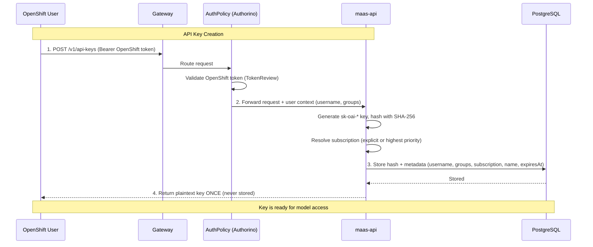
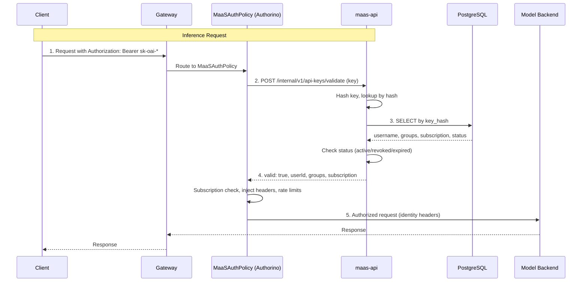

# API Key Authentication

This page explains the technical architecture of API key authentication in the MaaS platform. For practical how-to guides, see:

- [API Key Management](../user-guide/api-key-management.md) - Creating and managing keys
- [Model Discovery](../user-guide/model-discovery.md) - Listing available models
- [Inference](../user-guide/inference.md) - Making inference requests

---

## Overview

The platform uses a secure, API key–based authentication system. You authenticate with your OpenShift credentials to create long-lived API keys, which are stored as SHA-256 hashes in a PostgreSQL database. This approach provides several key benefits:

- **Long-Lived Credentials**: API keys remain valid until you revoke them or they expire (configurable), unlike short-lived Kubernetes tokens.
- **Subscription-Based Access Control**: Keys inherit your group membership at creation time; the gateway uses these groups for subscription lookup and rate limits.
- **Auditability**: Every request is tied to a specific key and identity; `last_used_at` tracks usage.
- **Show-Once Security**: The plaintext key is returned only at creation; only the hash is stored.

---

## API Key Creation Flow

When you create an API key, you trade your OpenShift identity for a long-lived credential that can be used for programmatic access.

### Key Concepts

- **Subscription binding**: Each key stores a MaaSSubscription name resolved at mint time. You can set it explicitly with the optional JSON field `subscription` on `POST /v1/api-keys`. If you omit it, the API selects your **highest-priority** accessible subscription (ties break deterministically).
- **Subscription access**: Your access is still determined by MaaSAuthPolicy and MaaSSubscription, which map groups to models and rate limits. The bound name is used for gateway subscription resolution and metering.
- **User Groups**: At creation time, your current group membership is stored with the key. These groups are used for subscription-based authorization when the key is validated.
- **API Key**: A cryptographically secure string with `sk-oai-*` prefix. The plaintext is shown once; only the SHA-256 hash is stored in PostgreSQL.
- **Expiration**: Keys have a configurable TTL via `expiresIn` (e.g., `30d`, `90d`, `1h`). If omitted, the key defaults to the configured maximum (e.g., 90 days).

The create response includes a `subscription` field echoing the bound subscription name.

### Creation Flow Diagram

This diagram illustrates the process of creating an API key:

---

## API Key Validation Flow

When you use an API key for inference, the gateway validates it via the MaaS API before allowing the request.

### Validation Flow Diagram

The validation endpoint (`/internal/v1/api-keys/validate`) is called by Authorino on every request that bears an `sk-oai-*` token. It:

1. Hashes the incoming key and looks it up in the database
2. Returns `valid: true` with `userId`, `groups`, and `subscription` if the key is active and not expired
3. Returns `valid: false` with a reason if the key is invalid, revoked, or expired

After a successful lookup, maas-api asynchronously updates `last_used_at` in the background. To prevent Postgres row-lock contention when many requests share a single key, these writes are **debounced**: at most one write is issued per key per `LAST_USED_DEBOUNCE_SECS` window (default 60 s). Set `LAST_USED_DEBOUNCE_SECS=0` on the maas-api Deployment to write on every validation.

---

## Subscription Binding and Priority

Each API key is bound to a single MaaSSubscription at creation time. This binding determines:

- Which models the key can access
- What rate limits apply
- Metadata attached to requests for observability

### Automatic Selection

When you create a key without specifying a `subscription`, the API selects the highest-priority accessible subscription:

1. Filter to subscriptions where your groups match `spec.owner.groups`
2. Sort by `spec.priority` (descending)
3. On ties, use deterministic ordering (e.g., token limit, then name)
4. Select the first subscription

### Explicit Selection

Specify `"subscription": "name"` in the create request body to bind to a specific subscription. The API validates that you have access to that subscription (group membership check).

### Priority Ties

If two MaaSSubscriptions have the same `spec.priority`, the controller logs a warning and sets the `SpecPriorityDuplicate` status condition. Operators should assign distinct priorities to avoid ambiguity. When ties occur, selection uses a deterministic fallback order.

---

## Group Membership Snapshots

API keys store your group membership **at creation time**. This snapshot model has important implications:

### Why Snapshots?

- **Performance**: Validation doesn't require real-time group lookups on every inference request
- **Consistency**: Your access level doesn't change mid-session
- **Auditability**: Historical requests show exactly what groups were active

### When Groups Change

If your group membership changes (role change, offboarding, promotion), existing API keys retain the **old** groups and subscription until revoked. This is intentional for the reasons above, but requires active key management:

**Administrators must revoke keys when:**
- User leaves the organization
- User's role changes significantly
- Security incident requires immediate access revocation

See [API Key Administration](../configuration-and-management/api-key-administration.md) for bulk revocation procedures.

---

## Related Documentation

**User Guides:**
- [API Key Management](../user-guide/api-key-management.md) - Creating and managing keys
- [Model Discovery](../user-guide/model-discovery.md) - Listing available models
- [Inference](../user-guide/inference.md) - Making inference requests

**Concepts:**
- [Model Access Control](model-access-control.md) - How model discovery and access decisions work
- [Access and Quota Overview](subscription-overview.md) - How policies and subscriptions work

**Administration:**
- [API Key Administration](../configuration-and-management/api-key-administration.md) - Bulk revocation and cleanup
