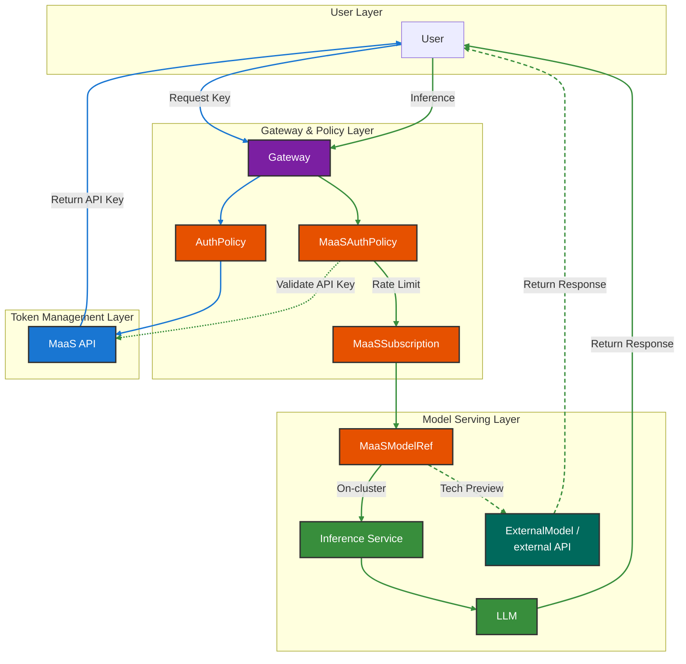
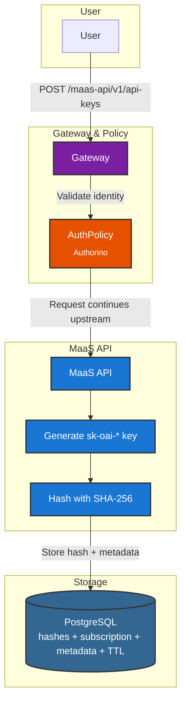
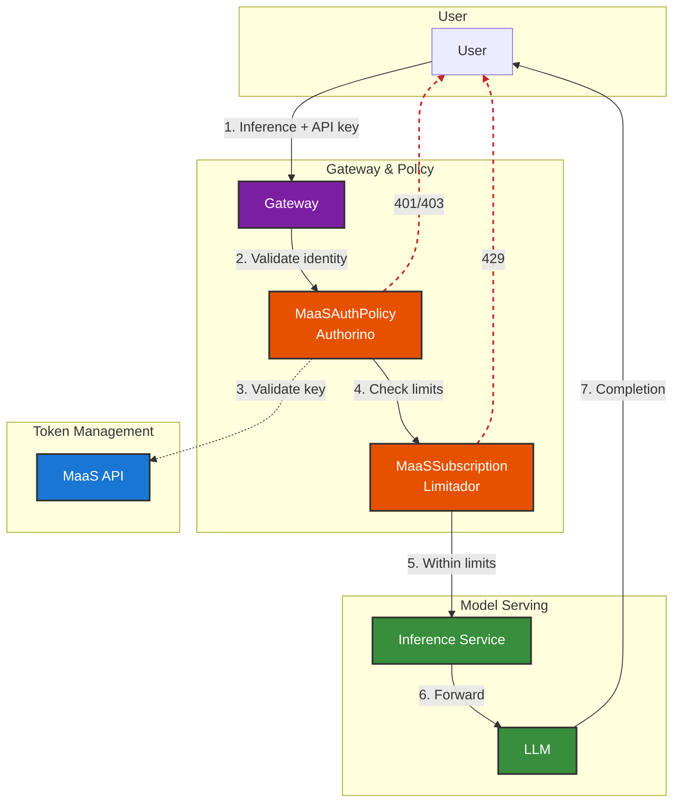
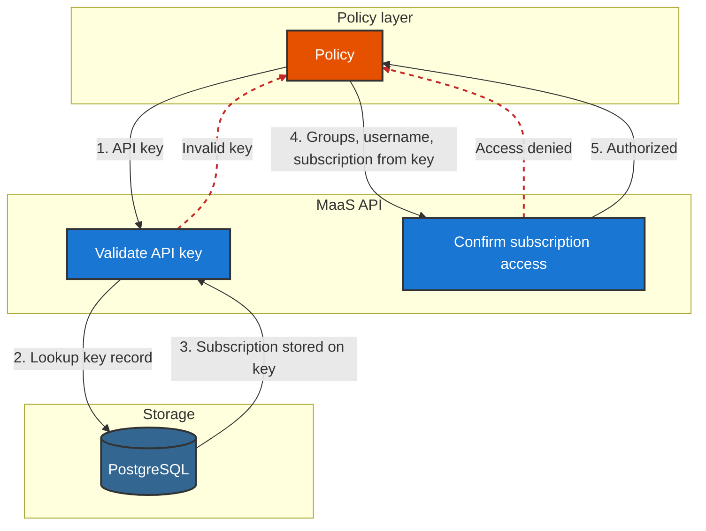
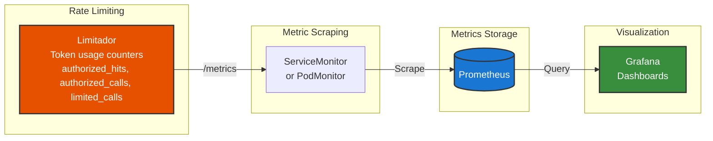
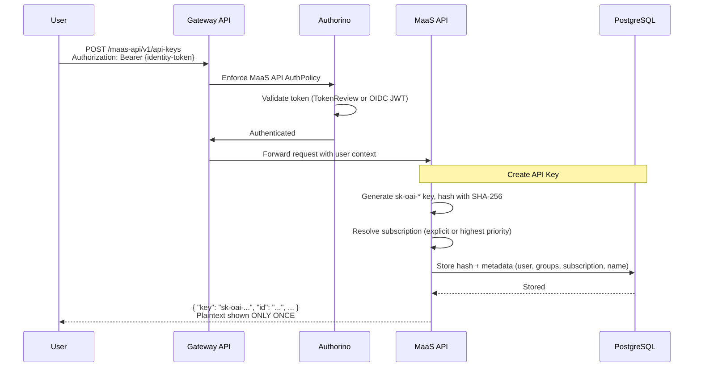
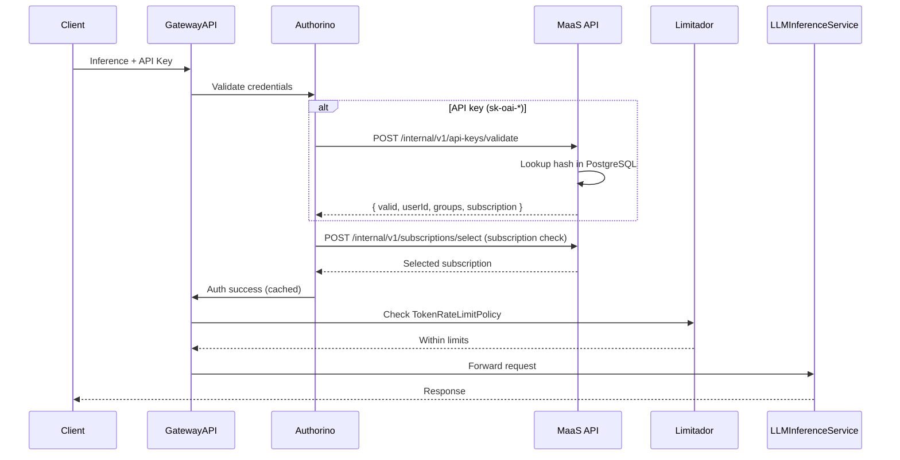

# MaaS Platform Architecture

## Overview

The MaaS Platform is a Kubernetes-native layer for AI model serving built on [Gateway API](https://gateway-api.sigs.k8s.io/) and policy controllers ([Kuadrant](https://docs.kuadrant.io/), [Authorino](https://docs.kuadrant.io/1.0.x/authorino/), [Limitador](https://docs.kuadrant.io/1.0.x/limitador/)). It provides policy-based authentication and authorization, plus subscription-based rate limiting.

Our future plans include improved request routing and discovery—and we're already sketching what comes after that.

## Deployment Architecture

MaaS is deployed as a sub-component of the **AI Gateway Operator**, managed by the ODH/RHOAI operator. Enabling `aigateway.modelsAsAService: Managed` in your `DataScienceCluster` triggers the following component chain:

```
DataScienceCluster
  └── aigateway.modelsAsAService: Managed
        └── AI Gateway Operator
              └── maas-controller
                    └── maas-api, Tenant, MaaSAuthPolicy, MaaSSubscription, ...
```

This replaces the previous `kserve.modelsAsService` nesting. KServe is no longer a prerequisite for MaaS — include it only if you need independent model serving.

## Architecture

### 🏗️ High-Level Architecture

The MaaS Platform is a layer for **authorization and rate limiting** built on [Kuadrant](https://docs.kuadrant.io/). It sits in front of **models** you deploy on the cluster; the same pattern is expected to extend to models hosted outside the cluster over time.

**Our main components include:**

- **Gateway (`maas-default-gateway`)** — Entry point for traffic using [Gateway API](https://gateway-api.sigs.k8s.io/); HTTPRoutes attach here.
- **[Kuadrant](https://docs.kuadrant.io/1.4.x/)** — Policy engine: connects routes and **AuthPolicy** resources to the Gateway and orchestrates enforcement on the hot path.
- **[Authorino](https://docs.kuadrant.io/1.4.x/authorino/)** — **Authentication and authorization** at the edge.
- **[Limitador](https://docs.kuadrant.io/1.4.x/limitador/)** — **Rate limiting** and tracking usage against subscription limits.
- **maas-api** — Custom service for **API key minting** and **validation** (including the internal endpoint the gateway calls for `sk-oai-*` keys).

**Main Flows:**

- **Key minting** (blue) — Obtain `sk-oai-*` API keys for programmatic access to models (after authenticating with your cluster identity or configured OIDC). Each mint **binds a subscription** to the key; that association is stored with the key and used on inference.
- **Inference** (green) — Call deployed models to generate completions using an API key (and subscription) on the inference route.




### Key Minting Flow — Request & Validation

**Flow summary:**

1. User sends `POST /maas-api/v1/api-keys` with `Authorization: Bearer {identity-token}`.
    - The body sets which **MaaSSubscription** to bind (`subscription`), or omits it so the platform picks an accessible one (for example by priority).
    - That subscription is **stored on the key** at mint; inference later reads it from the key record, not from per-request headers.
2. **Validate identity** — **Authorino** (AuthPolicy) checks the token using the configured method:
    - **`kubernetesTokenReview`** — OpenShift cluster tokens
    - **OIDC JWT validation** — external IdP (for example Keycloak) — **Tech Preview**
3. After authentication, the **request** is forwarded to **MaaS API** (key minting) on the gateway upstream path, with identity context available for minting—**Authorino** validates the request; it does not proxy or forward the HTTP call to MaaS API itself.
4. **MaaS API** handles key minting using that authenticated identity and the requested subscription binding.
5. The service generates a random `sk-oai-*` key and hashes it with SHA-256.
6. Only the hash and metadata (username, groups, name, `subscription` — the MaaSSubscription name bound at mint, `expiresAt`) are stored in PostgreSQL.
7. The plaintext key is returned to the user **only in this minting response** (show-once), along with `expiresAt`; it is **not** exposed again on later reads. The diagram below stops at storage and does not show the HTTP response back to the user.

Every key expires. With **operator-managed** MaaS, the cluster operator sets the maximum lifetime on the **`Tenant`** CR: **`spec.apiKeys.maxExpirationDays`** (see [Tenant CR](../install/maas-setup.md#tenant-cr)). **`maas-api`** applies that cap as **`API_KEY_MAX_EXPIRATION_DAYS`** (for example 90 days by default when defaults apply). Omit **`expiresIn`** on create to use that maximum, or set a shorter **`expiresIn`** (e.g., `30d`, `90d`, `1h`) within the configured cap. The response always includes **`expiresAt`** (RFC3339).



!!! Tip "OIDC Support"
    **Tech Preview:** OIDC JWT validation on the `maas-api` route is optional alongside OpenShift `kubernetesTokenReview`. Model routes still rely on API-key auth; the typical flow is authenticate at `maas-api`, mint an `sk-oai-*` key, then use that key for discovery and inference.

!!! note "PostgreSQL"
    A **PostgreSQL database is required** and is **not included** with the MaaS deployment. The deploy script provides a basic PostgreSQL deployment for development and testing—**this is not intended for production use**. For production, provision and configure your own PostgreSQL instance.

### Inference Flow — Through MaaS Objects

**Flow summary:**

1. User sends inference request with an API key.
2. **Validate identity** — request reaches **MaaSAuthPolicy (Authorino)** via the Gateway.
3. **MaaSAuthPolicy** validates the key via **MaaS API**; on failure returns 401/403.
4. **Check limits** — **MaaSSubscription (Limitador)** enforces token rate limits; on exceed returns 429.
5. Request reaches Inference Service when within limits.
6. Inference Service forwards to the LLM.
7. Completion Response is returned to the user.



### Auth & Validation Flow (Deep Dive)

For inference with an `sk-oai-*` API key, the policy layer performs **two MaaS API steps** in order. **First** the key is validated against PostgreSQL. **Subscription** is not read from request headers for API keys—it is **stored on the key record** when the key was minted and is returned as part of validation. **Second**, that subscription name, together with the username and groups from the key record, is used to confirm the caller may use that subscription for the target model (for example, that the subscription exists, the user still has access, and the model is part of that subscription).

**Flow summary:**

1. The **policy layer** sends the API key to the MaaS API **validate-key** path.
2. **Validate key** — MaaS API parses the key, looks up the salted hash in PostgreSQL, and rejects unknown, revoked, expired, or malformed keys (and keys with no subscription bound). On success it returns identity (username, groups, key ID) and the **subscription name from the key record** (mint-time binding).
3. **Subscription from the key** — The next step uses that subscription name as the requested subscription—**not** a client-supplied `X-MaaS-Subscription` value. For API keys the subscription in the request body to subscription selection is exactly the subscription returned from validation.
4. **Confirm subscription access** — MaaS API subscription selection checks that the user and groups can use that subscription and that the requested model is allowed; failures surface as access denied (for example 403) to the policy layer.
5. On success, identity and subscription context are available for rate limiting and metrics. That context is **not** forwarded as HTTP headers to upstream model workloads (defense in depth). Results may be cached briefly by the policy layer to avoid repeating work on every request.



### Observability Flow

Token usage and rate-limit data flow from Limitador into Prometheus and onward to dashboards.

**Flow summary:**

1. Limitador stores token usage counters (e.g., `authorized_hits`, `authorized_calls`, `limited_calls`) with labels (`user`, `model`).
2. A ServiceMonitor (or Kuadrant PodMonitor) configures Prometheus to scrape Limitador's `/metrics` endpoint.
3. Prometheus stores the metrics in its time-series database.
4. Grafana (or other visualization tools) queries Prometheus to build dashboards for usage, billing, and operational health.



## 🔄 Component Flows

### 1. API Key Creation Flow (MaaS API)

Users create API keys by authenticating with an accepted identity token (OpenShift today, or OIDC when configured on the `maas-api` route). The MaaS API generates a key, stores only the hash in PostgreSQL, and returns the plaintext once:



### 2. Model Inference Flow

Inference requests use the API key. Authorino validates it via HTTP callback (with caching); Limitador enforces subscription-based token limits:


