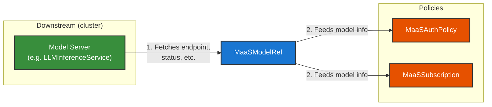

# MaaS Models

MaaS uses **MaaSModelRef** to identify model servers that live on the cluster. Each MaaSModelRef is a reference to a model server—it holds the information MaaS needs to perform authentication, authorization, and rate limiting.

By using a single unified object (MaaSModelRef) for all model types, MaaS can handle different kinds of model servers—each with its own backend and lifecycle—through one consistent interface. The controller uses a **provider paradigm** to distinguish between types: each model type (for example, LLMInferenceService, external APIs) has a provider that knows how to reconcile and resolve that type. Today, vLLM (via LLMInferenceService) is the supported provider; additional providers may be added in the future.

## The Model Reference

A MaaS model is a reference to a model server (for example, an LLMInferenceService or external API). The MaaS controller, running in the **control plane**, reconciles these references and gathers the information needed to route requests and enforce policies—such as the model's endpoint URL and readiness status.

That information is then used by MaaSSubscription and MaaSAuthPolicy to complete their logic: validating access, selecting subscriptions, and enforcing rate limits.

## How Model Information Is Used

Both **MaaSAuthPolicy** (access) and **MaaSSubscription** (quota) reference models by their **MaaSModelRef** name. They rely on the information that MaaSModelRef provides—gathered at the control plane—to:

- Route requests to the correct model endpoint
- Validate that the user has access to the requested model
- Apply the correct rate limits for that model

## Summary

- **MaaSModelRef** — Stores the reference to a model server; the controller gathers the information needed for auth and routing.
- **MaaSAuthPolicy** and **MaaSSubscription** — Reference models by name and use that information to enforce access and quota.
- **Control plane** — The MaaS controller reconciles model references and populates the data that policies and subscriptions depend on.

For configuration details and how to create and use MaaSModelRef, see [Quota and Access Configuration](quota-and-access-configuration.md) in the Administration Guide.
