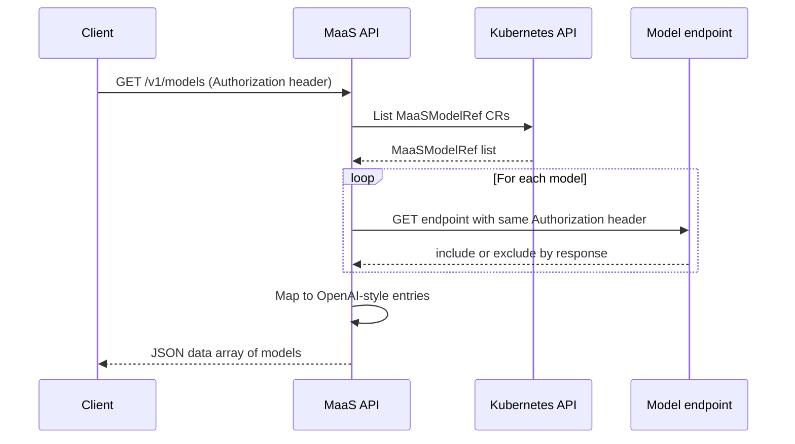

# Model listing flow

This document describes how the **GET /v1/models** endpoint discovers and returns the list of available models.

The list is **based on MaaSModelRef** custom resources: the API considers MaaSModelRef objects cluster-wide (all namespaces), then filters by access.

## Overview

When a client calls **GET /v1/models** with an **Authorization** header, the MaaS API returns an OpenAI-compatible list of models.

Each entry includes an `id`, **`url`** (the model’s endpoint), a `ready` flag, and related metadata. The list is built from **MaaSModelRef** CRs. The API then validates access by probing each model’s endpoint with the same Authorization header; only models the client can access are included in the response.

!!! note "Model endpoints and routing"
    The returned value includes a **URL** per model; clients use that URL to call the model (e.g. for chat or completions).

    Currently each model is served on a **different endpoint**. **Body Based Routing** is being evaluated to provide a more unified OpenAI API feel (single endpoint with model selection in the request body).

## MaaSModelRef flow

When the [MaaS controller](https://github.com/opendatahub-io/models-as-a-service/tree/main/maas-controller) is installed and the API is configured with a MaaSModelRef lister, the flow is:

1. The MaaS API discovers **MaaSModelRef** custom resources **cluster-wide** (all namespaces) using a cached lister (informer-backed).

2. For each MaaSModelRef, it reads **id** (`metadata.name`), **url** (`status.endpoint`), **ready** (`status.phase == "Ready"`), and **namespace** (`metadata.namespace`, returned as `ownedBy`). The controller populates `status.endpoint` and `status.phase` from the underlying backend.

3. **Access validation**: The API probes each model’s `/v1/models` endpoint with the client’s Authorization header. Models returning **2xx** or **405** are included; **401/403/404** are excluded. Each probe must respond within the access check timeout (default 15 seconds); models that do not respond in time are excluded (fail-closed). See [Access Check Timeout](#access-check-timeout) to tune this value.

    !!! note "ExternalModel bypass"
        ExternalModel kinds are included if `status.phase == "Ready"` without probe validation.

4. For each model, the API reads **annotations** from the MaaSModelRef to populate `modelDetails` in the response (display name, description, use case, context window). See [MaaSModelRef annotations](../reference/crds/maas-model-ref.md#annotations) for the full list.

5. The filtered list is returned to the client.



### Benefits

- **List is based on MaaSModelRefs**: Only models registered as a MaaSModelRef appear. The controller reconciles each MaaSModelRef and sets its endpoint and phase; access and quotas are controlled by MaaSAuthPolicy and MaaSSubscription.

- **Access-filtered**: The API probes each model with the client’s Authorization header (passed through as-is), so the returned list only includes models the client can actually use.

- **Consistent with gateway**: The same model names and routes are used for inference; the list matches what the gateway will accept for that client.

If the API is not configured with a MaaSModelRef lister, or if listing fails (e.g. CRD not installed, no RBAC, or server error), the API returns an empty list or an error.

### Access Check Timeout

The maas-api deployment supports the following environment variable to control access validation probe timing:

| Variable | Description | Default | Constraints |
|----------|-------------|---------|-------------|
| `ACCESS_CHECK_TIMEOUT_SECONDS` | Timeout in seconds for each model access validation probe during `GET /v1/models`. Models that do not respond within this window are excluded from the response (fail-closed). | `15` | Must be ≥ 1 |

!!! tip "When to increase"
    If models are missing from `GET /v1/models` responses and maas-api logs show probe timeouts, increase `ACCESS_CHECK_TIMEOUT_SECONDS` to give slower backends more time to respond. This is common when model endpoints have cold-start latency or are under heavy load.

## Subscription Filtering and Aggregation

The `/v1/models` endpoint automatically filters models based on your authentication method and optional headers.

### Authentication-Based Behavior

#### API Key Authentication (Bearer sk-oai-*)
When using an API key, the subscription is automatically determined from the key:
- Returns **only** models from the subscription bound to the API key at mint time

```bash
# API key bound to "premium-subscription"
curl -H "Authorization: Bearer sk-oai-abc123..." \
     https://maas.example.com/maas-api/v1/models

# Returns models from "premium-subscription" only
```

#### User Token Authentication (OpenShift/OIDC tokens)
When using a user token, you have flexible options:

**Default (no X-MaaS-Subscription header)**:
- Returns **all** models from all subscriptions you have access to
- Models are deduplicated and subscription metadata is attached

```bash
# User with access to "basic" and "premium" subscriptions
curl -H "Authorization: Bearer $(oc whoami -t)" \
     https://maas.example.com/maas-api/v1/models

# Returns models from both subscriptions with subscription metadata
```

**With X-MaaS-Subscription header** (optional):
- Returns only models from the specified subscription
- Behaves like an API key request - allows you to scope your query to a specific subscription

```bash
# Filter to only "premium" subscription models
curl -H "Authorization: Bearer $(oc whoami -t)" \
     -H "X-MaaS-Subscription: premium-subscription" \
     https://maas.example.com/maas-api/v1/models

# Returns only "premium-subscription" models
```

!!! tip "User token filtering"
    The `X-MaaS-Subscription` header allows user token requests to filter results to a specific subscription. This is useful when you have access to many subscriptions but only want to see models from one.

### Subscription Metadata

All models in the response include a `subscriptions` array with metadata for each subscription providing access to that model:

```json
{
  "object": "list",
  "data": [
    {
      "id": "llama-2-7b-chat",
      "created": 1672531200,
      "object": "model",
      "owned_by": "model-namespace",
      "url": "https://maas.example.com/llm/llama-2-7b-chat",
      "ready": true,
      "subscriptions": [
        {
          "name": "basic-subscription",
          "displayName": "Basic Tier",
          "description": "Basic subscription with standard rate limits"
        },
        {
          "name": "premium-subscription",
          "displayName": "Premium Tier",
          "description": "Premium subscription with higher rate limits"
        }
      ]
    }
  ]
}
```

## Registering models

To have models appear via the **MaaSModelRef** flow:

1. Install the **MaaS controller** (CRDs, controller deployment, and optionally the default-deny policy). See [maas-controller README](https://github.com/opendatahub-io/models-as-a-service/tree/main/maas-controller).

2. Ensure the underlying **LLMInferenceService** exists and (if applicable) has an HTTPRoute created by KServe.

3. Create a **MaaSModelRef** for each model you want to expose, in the **same namespace** as the backend:

        apiVersion: maas.opendatahub.io/v1alpha1
        kind: MaaSModelRef
        metadata:
          name: my-model-name   # Becomes the model "id" in GET /v1/models
          namespace: llm        # MUST match LLMInferenceService namespace
          annotations:
            openshift.io/display-name: "My Model"
            openshift.io/description: "A general-purpose LLM"
        spec:
          modelRef:
            kind: LLMInferenceService
            name: my-llm-isvc-name   # References resource in same namespace

4. The controller reconciles the MaaSModelRef and sets `status.endpoint` and `status.phase`. The MaaS API will then include this model in GET /v1/models when it lists MaaSModelRef CRs.

You can use the [maas-system samples](https://github.com/opendatahub-io/models-as-a-service/tree/main/docs/samples/maas-system) as a template; the install script deploys LLMInferenceService + MaaSModelRef + MaaSAuthPolicy + MaaSSubscription together so dependencies resolve correctly.

## MaaSModelRef Status and Phases

The controller populates `status.endpoint` and `status.phase` during reconciliation. The API uses these fields when listing models.

**Phase values:**

| Phase | Meaning |
|-------|---------|
| **Pending** | Model exists but HTTPRoute or backend is not ready |
| **Ready** | Model is ready for inference |
| **Failed** | Reconciliation failed (unknown `kind`, backend error, or unsupported) |

!!! note "Unhealthy phase defined but unused"
    The CRD enum includes `Unhealthy`, but the controller currently only sets `Pending`, `Ready`, or `Failed`.

See [MaaSModelRef CRD reference](../reference/crds/maas-model-ref.md) for complete status field documentation.

## Annotations for UI and API

MaaSModelRef annotations (`openshift.io/display-name`, `openshift.io/description`, `opendatahub.io/genai-use-case`, `opendatahub.io/context-window`) are consumed by both the OpenShift console and the MaaS API `/v1/models` endpoint (`modelDetails` field).

See [MaaSModelRef annotations](../reference/crds/maas-model-ref.md#annotations) for the complete list and examples.

---

## Related documentation

- [MaaS Controller README](https://github.com/opendatahub-io/models-as-a-service/tree/main/maas-controller) — install and MaaSModelRef/MaaSAuthPolicy/MaaSSubscription
- [Model setup](./model-setup.md) — configuring LLMInferenceServices (gateway reference) as backends for MaaSModelRef
- [Architecture](../concepts/architecture.md) — overall MaaS architecture
