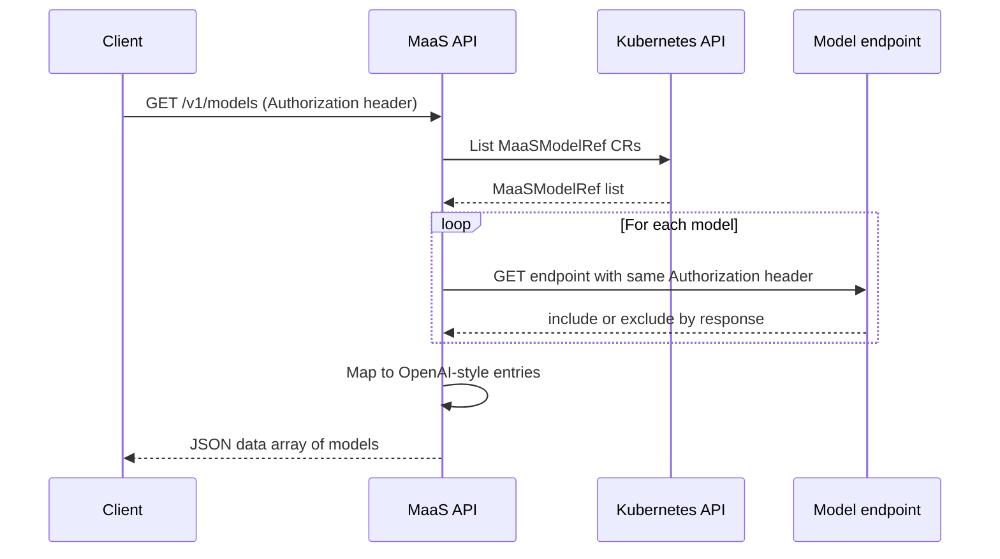

# Model listing flow

This document describes how the **GET /v1/models** endpoint discovers and returns the list of available models.

The list is **based on MaaSModelRef** custom resources: the API returns models that are registered as MaaSModelRefs in its configured namespace.

## Overview

When a client calls **GET /v1/models** with an **Authorization** header, the MaaS API returns an OpenAI-compatible list of models.

Each entry includes an `id`, **`url`** (the model’s endpoint), a `ready` flag, and related metadata. The list is built from **MaaSModelRef** CRs. The API then validates access by probing each model’s endpoint with the same Authorization header; only models the client can access are included in the response.

!!! note "Model endpoints and routing"
    The returned value includes a **URL** per model; clients use that URL to call the model (e.g. for chat or completions).

    Currently each model is served on a **different endpoint**. **Body Based Routing** is being evaluated to provide a more unified OpenAI API feel (single endpoint with model selection in the request body).

## MaaSModelRef flow

When the [MaaS controller](https://github.com/opendatahub-io/models-as-a-service/tree/main/maas-controller) is installed and the API is configured with a MaaSModelRef lister and namespace, the flow is:

1. The MaaS API lists all **MaaSModelRef** custom resources in its configured namespace (e.g. `opendatahub`). It reads them from an **in-memory cache** in the maas-api component (maintained by a Kubernetes informer), so it does not call the Kubernetes API on every request.

2. For each MaaSModelRef, it reads **id** (`metadata.name`), **url** (`status.endpoint`), **ready** (`status.phase == "Ready"`), and related metadata. The controller has populated `status.endpoint` and `status.phase` from the underlying LLMInferenceService (for llmisvc) or HTTPRoute/Gateway.

3. **Access validation**: The API probes each model’s `/v1/models` endpoint with the **exact Authorization header** the client sent (passed through as-is). Only models that return **2xx**, **3xx** or **405** are included in the response. This ensures the list only shows models the client is authorized to use.

4. The filtered list is returned to the client.



### Benefits

- **List is based on MaaSModelRefs**: Only models registered as a MaaSModelRef appear. The controller reconciles each MaaSModelRef and sets its endpoint and phase; access and quotas are controlled by MaaSAuthPolicy and MaaSSubscription.

- **Access-filtered**: The API probes each model with the client’s Authorization header (passed through as-is), so the returned list only includes models the client can actually use.

- **Consistent with gateway**: The same model names and routes are used for inference; the list matches what the gateway will accept for that client.

If the API is not configured with a MaaSModelRef lister and namespace, or if listing fails (e.g. CRD not installed, no RBAC, or server error), the API returns an empty list or an error.

## Subscription Filtering and Aggregation

The `/v1/models` endpoint supports filtering and aggregating models across subscriptions using request headers.

### Request Headers

- **`X-MaaS-Subscription`** (optional): Filter models to a specific subscription by name
- **`X-MaaS-Return-All-Models`** (optional): When set to `"true"`, returns models from all subscriptions the user has access to

!!! warning "Conflicting headers"
    You cannot specify both `X-MaaS-Subscription` and `X-MaaS-Return-All-Models` headers in the same request. This returns `400 Bad Request`.

### Behavior Modes

#### Default (no header)
Returns models from a single subscription:
- If the user has access to only one subscription, models from that subscription are returned
- If the user has access to multiple subscriptions, returns `403 Forbidden` with message: "user has access to multiple subscriptions, must specify subscription using X-MaaS-Subscription header"

#### Single Subscription (`X-MaaS-Subscription: <name>`)
Returns only models accessible via the specified subscription:
```bash
curl -H "Authorization: Bearer $TOKEN" \
     -H "X-MaaS-Subscription: premium-subscription" \
     https://maas.example.com/maas-api/v1/models
```

#### All Subscriptions (`X-MaaS-Return-All-Models: true`)
Returns models from all subscriptions the user has access to, with subscription metadata attached. If the user has access to zero subscriptions, returns HTTP 200 with an empty data array (not an error), allowing clients to handle this deterministically:
```bash
curl -H "Authorization: Bearer $TOKEN" \
     -H "X-MaaS-Return-All-Models: true" \
     https://maas.example.com/maas-api/v1/models
```

### Subscription Metadata

All models in the response include a `subscriptions` array with metadata for each subscription providing access to that model:

```json
{
  "object": "list",
  "data": [
    {
      "id": "llama-2-7b-chat",
      "created": 1672531200,
      "object": "model",
      "owned_by": "model-namespace",
      "url": "https://maas.example.com/llm/llama-2-7b-chat",
      "ready": true,
      "subscriptions": [
        {
          "name": "basic-subscription",
          "displayName": "Basic Tier",
          "description": "Basic subscription with standard rate limits"
        },
        {
          "name": "premium-subscription",
          "displayName": "Premium Tier",
          "description": "Premium subscription with higher rate limits"
        }
      ]
    }
  ]
}
```

### Deduplication Behavior

When `X-MaaS-Return-All-Models: true` is used, models are deduplicated by `(id, url)` key:

- **Same id + same URL**: Single entry with subscriptions aggregated into the `subscriptions` array
- **Same id + different URLs**: Separate entries (different model endpoints)

**Example:**
- Model `gpt-3.5` at URL `https://example.com/gpt-3.5` is accessible via subscriptions A and B
  - Result: One entry with `subscriptions: [{name: "A"}, {name: "B"}]`
- Model `gpt-3.5` at URL `https://example.com/gpt-3.5-premium` is only in subscription B
  - Result: Separate entry with `subscriptions: [{name: "B"}]`

!!! tip "Subscription metadata fields"
    The `displayName` and `description` fields are read from the MaaSSubscription CRD's `spec.displayName` and `spec.description` fields. If these fields are not set in the CRD, they will be empty strings in the response.

## Registering models

To have models appear via the **MaaSModelRef** flow:

1. Install the **MaaS controller** (CRDs, controller deployment, and optionally the default-deny policy). See [maas-controller README](https://github.com/opendatahub-io/models-as-a-service/tree/main/maas-controller).

2. Ensure the underlying **LLMInferenceService** exists and (if applicable) has an HTTPRoute created by KServe.

3. Create a **MaaSModelRef** for each model you want to expose, referencing the LLMIS:

        apiVersion: maas.opendatahub.io/v1alpha1
        kind: MaaSModelRef
        metadata:
          name: my-model-name   # This becomes the model "id" in GET /v1/models
          namespace: opendatahub
        spec:
          modelRef:
            kind: LLMInferenceService
            name: my-llm-isvc-name
            namespace: llm

4. The controller reconciles the MaaSModelRef and sets `status.endpoint` and `status.phase`. The MaaS API (in the same namespace) will then include this model in GET /v1/models when it lists MaaSModelRef CRs.

You can use the [maas-system samples](https://github.com/opendatahub-io/models-as-a-service/tree/main/docs/samples/maas-system) as a template; the install script deploys LLMInferenceService + MaaSModelRef + MaaSAuthPolicy + MaaSSubscription together so dependencies resolve correctly.

---

## Related documentation

- [MaaS Controller README](https://github.com/opendatahub-io/models-as-a-service/tree/main/maas-controller) — install and MaaSModelRef/MaaSAuthPolicy/MaaSSubscription
- [Model setup](./model-setup.md) — configuring LLMInferenceServices (gateway reference) as backends for MaaSModelRef
- [Architecture](../architecture.md) — overall MaaS architecture
