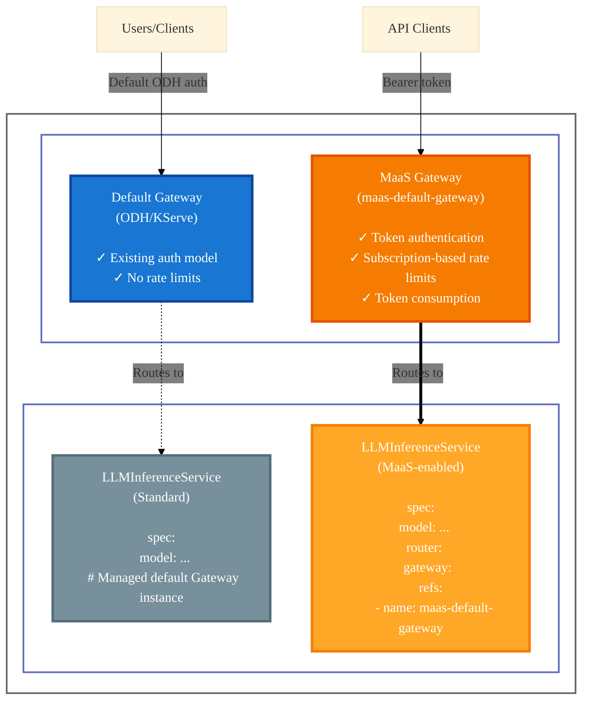

# Model Setup (On Cluster) Guide

This guide explains how to configure models so they appear in the MaaS platform and are subject to authentication, rate limiting, and token-based consumption tracking.

!!! tip "Subscription model (recommended)"
    When using the **MaaS controller**, model access and rate limits are controlled by **MaaSModelRef**, **MaaSAuthPolicy**, and **MaaSSubscription** CRDs. See [Quota and Access Configuration](quota-and-access-configuration.md) and [Model Listing Flow](model-listing-flow.md).

## Supported model types

MaaS is planning support for multiple model types through a **provider paradigm**: each MaaSModelRef references a model backend by `kind` (e.g., `LLMInferenceService`, `ExternalModel`). The controller uses provider-specific logic to reconcile and resolve each type.

**LLMInferenceService** will be initially supported. The initial release focuses on using KServe for on-cluster models. This guide describes the configuration differences between the default LLMInferenceService and the MaaS-enabled one to help users understand the differences.

## How the model list is built

When the [MaaS controller](https://github.com/opendatahub-io/models-as-a-service/tree/main/maas-controller) is installed, you register models by creating **MaaSModelRef** CRs that reference a model backend (e.g., an LLMInferenceService). The controller reconciles each MaaSModelRef and sets `status.endpoint` and `status.phase`. The MaaS API lists these MaaSModelRef CRs and returns them as the model list. Access and quotas are controlled by **MaaSAuthPolicy** and **MaaSSubscription**. See [Model listing flow](model-listing-flow.md) for details.

## MaaS-capable vs standard gateways

MaaS uses a **segregated gateway approach**. Models explicitly opt in to MaaS capabilities by routing through the **MaaS gateway** (`maas-default-gateway`). Models that use the **standard gateway** (ODH/KServe default) do not use MaaS policies.

| | Standard gateway (ODH/KServe) | MaaS gateway (`maas-default-gateway`) |
|--|-----------------------------|--------------------------------------|
| **Authentication** | Existing ODH/KServe auth model | Token-based (API keys, OpenShift tokens) |
| **Rate limits** | None | Subscription-based (Limitador) |
| **Token consumption** | Not tracked | Tracked per usage |
| **Access control** | Platform-level | Per-model (MaaSAuthPolicy, MaaSSubscription) |
| **Use case** | Standard inference without MaaS policies | MaaS-managed access, quotas, and tracking |

Models that use the standard gateway do not appear in the MaaS model list and are not subject to MaaS policies. To use MaaS features, configure your model to route through the MaaS gateway.

## Gateway architecture (diagram)

The diagram below shows how models can route through either gateway.



!!! note
    The `maas-default-gateway` is created automatically during MaaS platform installation. You don't need to create it manually.

### Benefits of the segregated approach

- **Flexibility**: Different models can have different security and access requirements
- **Progressive adoption**: Teams can adopt MaaS features incrementally
- **Production control**: Production models get full policy enforcement when routed through the MaaS gateway
- **Multi-tenancy**: Different teams can use different gateways in the same cluster
- **Blast radius containment**: Issues with one gateway don't affect the other

## Prerequisites

Before configuring an LLMInferenceService for MaaS, ensure you have:

- **MaaS platform installed** with `maas-default-gateway` deployed
- **LLMInferenceService** resource created or planned
- **Cluster admin** or equivalent permissions to modify `LLMInferenceService` resources

## Configuring LLMInferenceService for MaaS

To make your LLMInferenceService available through the MaaS platform, **reference the maas-default-gateway** in the `LLMInferenceService` spec. This routes traffic through the MaaS gateway so authentication, rate limiting, and consumption tracking apply.

### Add gateway reference

Configure your `LLMInferenceService` to use the `maas-default-gateway` by adding the gateway reference in the `router` section:

```yaml
apiVersion: serving.kserve.io/v1alpha1
kind: LLMInferenceService
metadata:
  name: my-production-model
  namespace: llm
spec:
  model:
    uri: hf://Qwen/Qwen3-0.6B
    name: Qwen/Qwen3-0.6B
  replicas: 1
  
  # Connect to MaaS-enabled gateway
  router:
    route: { }
    gateway:
      refs:
        - name: maas-default-gateway
          namespace: openshift-ingress
  
  template:
    # ... container configuration ...
```

**Key points:**

- The `router.gateway.refs` field specifies which gateway to use
- Use `name: maas-default-gateway` and `namespace: openshift-ingress`
- **Without this specification**, the LLMInferenceService uses the default KServe gateway and **is not subject to MaaS policies**

### Complete example

Here's a complete example of an LLMInferenceService configured for MaaS:

```yaml
apiVersion: serving.kserve.io/v1alpha1
kind: LLMInferenceService
metadata:
  name: qwen3-model
  namespace: llm
spec:
  model:
    uri: hf://Qwen/Qwen3-0.6B
    name: Qwen/Qwen3-0.6B
  replicas: 1
  router:
    route: { }
    gateway:
      refs:
        - name: maas-default-gateway
          namespace: openshift-ingress
  template:
    containers:
      - name: main
        image: "vllm/vllm-openai:latest"
        resources:
          limits:
            nvidia.com/gpu: "1"
            memory: 12Gi
          requests:
            nvidia.com/gpu: "1"
            memory: 8Gi
```

## Updating existing models

To convert an existing LLMInferenceService to use MaaS:

### Method 1: Patch the Model

```bash
kubectl patch llminferenceservice my-production-model -n llm --type='json' -p='[
  {
    "op": "add",
    "path": "/spec/router/gateway/refs/-",
    "value": {
      "name": "maas-default-gateway",
      "namespace": "openshift-ingress"
    }
  }
]'

```

### Method 2: Edit the Resource

```bash
kubectl edit llminferenceservice my-production-model -n llm
```

Then add the gateway reference in `spec.router.gateway.refs`.

## Verification

After configuring your LLMInferenceService, verify it's accessible through MaaS:

**1. Check the model appears in the models list:**

```bash
# Get your MaaS token first, then:
curl -sSk ${HOST}/maas-api/v1/models \
    -H "Content-Type: application/json" \
    -H "Authorization: Bearer $TOKEN" | jq .
```

**2. Verify the model status:**

```bash
kubectl get llminferenceservice my-production-model -n llm
```

**3. Test inference request:**

```bash
# Use the MODEL_URL from the models list
curl -sSk -H "Authorization: Bearer $TOKEN" \
  -H "Content-Type: application/json" \
  -d '{"model": "my-production-model", "prompt": "Hello", "max_tokens": 50}' \
  "${MODEL_URL}"
```

## Troubleshooting

### Model Not Appearing in /maas-api/v1/models

- Verify the gateway reference is correct: `name: maas-default-gateway`, `namespace: openshift-ingress`
- Check that the model's status shows it's ready
- Ensure the model namespace is accessible (some configurations may restrict discovery)

### 401 Unauthorized When Accessing Model

- Verify your subscription (MaaSAuthPolicy, MaaSSubscription) grants access to the model
- Check that your API key or token is valid and has the correct permissions
- Ensure the model's MaaSModelRef and AuthPolicy are correctly configured

### 403 Forbidden When Accessing Model

- Ensure your subscription includes access to the model
- Verify MaaSAuthPolicy grants your group access
- Check that the maas-controller has reconciled the AuthPolicy

## References

- [Access and Quota Overview](subscription-overview.md) - Configure policies and subscriptions
- [Quota and Access Configuration](quota-and-access-configuration.md) - Detailed configuration
- [Model Access Behavior](model-access-behavior.md) - Expected behaviors when modifying model access
- [Architecture Overview](../architecture.md) - Understand the overall MaaS architecture
- [KServe LLMInferenceService Documentation](https://kserve.github.io/website/) - Official KServe documentation
