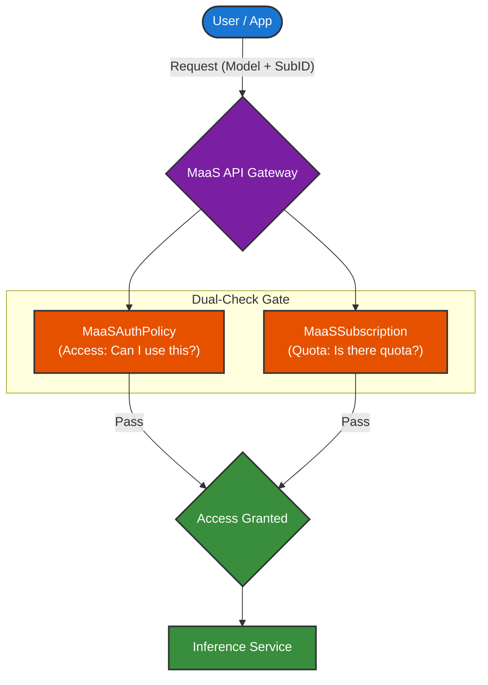

# Access and Quota Overview

When planning authorization for Models as a Service, it is important to understand how **policies** (MaaSAuthPolicy) and **subscriptions** (MaaSSubscription) work together. Both use RBAC references (subjects or owners). A user must have **both** a matching policy (access) and a matching subscription (quota) to use a model.

MaaSAuthPolicy and MaaSSubscription are namespace-scoped to `models-as-a-service`; they reference MaaSModelRefs (in e.g. `llm`) by `name` and `namespace` in their `modelRefs`.

## Policies vs. Subscriptions

| Concern | CRD | Purpose | Subjects/Owners |
|---------|-----|---------|-----------------|
| **Access** | MaaSAuthPolicy | Grants permission to use specific models | `subjects` (groups/users) |
| **Quota** | MaaSSubscription | Defines token rate limits for model usage | `owner` (groups/users) |
| **Model** | MaaSModelRef | Identifies models on the cluster; provides endpoint and status | — |

## Why Separate Policies and Subscriptions?

This separation lets you create **generic subscriptions** that span many models while still limiting access to specific models per team.

**Example:** You have a Premium subscription that spans 20 models. You want to give the `data-science-team` access to 5 of those models at the Premium subscription level.

**How to do it:**

1. Make `data-science-team` the **owner** of the Premium subscription (they get quota for all 20 models).
2. Create a **policy** that grants `data-science-team` access to only those 5 models.

The team can use only the 5 models specified in the policy. Their usage is governed by the subscription's rate limits.

**Benefits:**

- **Add or remove access per team** — Update the policy to grant or revoke access to models for that team; no changes to the subscription required.
- **Reuse one subscription across teams** — Another team (e.g., `ml-engineering`) can be an owner of the same Premium subscription but have a policy that grants access to a different subset of models (e.g., 8 of the 20). Each team gets the same quota tier but only sees the models you allow.

## Related Documentation

For configuration details, see:

- [Quota and Access Configuration](quota-and-access-configuration.md) — Step-by-step configuration for MaaSModelRef, MaaSAuthPolicy, and MaaSSubscription

Additional references:

- [Subscription Architecture](https://github.com/opendatahub-io/models-as-a-service/blob/main/archdiagrams/SubscriptionArch.md) — Design document for the subscription model
- [MaaS Controller old-vs-new flow](https://github.com/opendatahub-io/models-as-a-service/blob/main/maas-controller/docs/old-vs-new-flow.md) — Comparison of subscription-based flows
