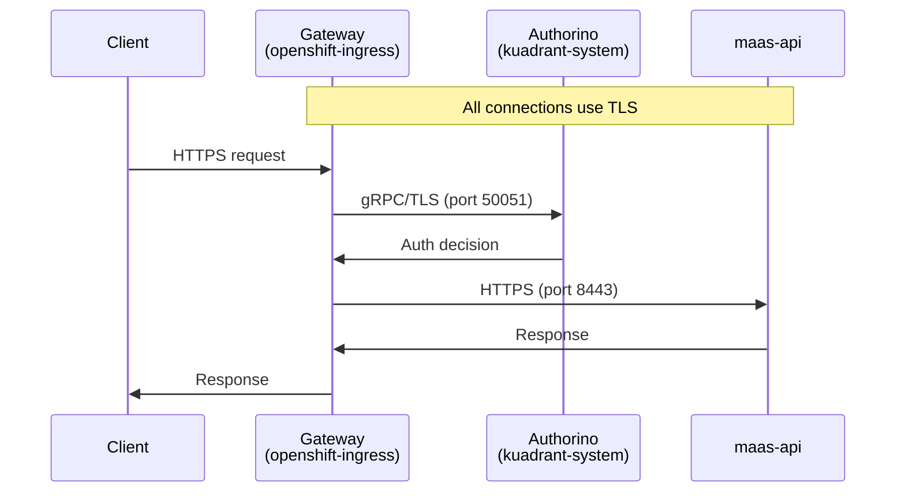

# TLS Configuration

This guide covers TLS configuration for the MaaS API component to enable encrypted communication for all API traffic.

!!! tip "Quick Verification"
    For TLS verification commands, see [Validation Guide - TLS Verification](../install/validation.md#tls-verification).

## Overview

The MaaS API supports end-to-end TLS encryption across all traffic paths:



When TLS is enabled:

- External API traffic is encrypted from client to backend
- Internal authentication traffic (Authorino → `maas-api`) is encrypted
- All certificate validation uses a trusted CA bundle

## Prerequisites

### Authorino TLS Configuration

Authorino handles two TLS-protected traffic flows: 

* **inbound** from the Gateway (listener TLS) 
* **outbound** to `maas-api` (for metadata lookups). 

For ODH/RHOAI deployments, the inbound flow is a [platform pre-requisite](https://github.com/opendatahub-io/kserve/tree/release-v0.15/docs/samples/llmisvc/ocp-setup-for-GA#ssl-authorino) for secure `LLMInferenceService` communication; only the outbound configuration is needed for MaaS.

For all deployments using `./scripts/deploy.sh` (both operator and kustomize modes with TLS enabled), both flows are configured automatically via `scripts/setup-authorino-tls.sh`. Use `--disable-tls-backend` with `deploy.sh` to skip this and manage Authorino TLS separately. To run the standalone script:

```bash
./scripts/setup-authorino-tls.sh
# Use AUTHORINO_NAMESPACE=rh-connectivity-link for RHCL
```

#### Gateway → Authorino (Inbound TLS)

Enables TLS on Authorino's gRPC listener for incoming authentication requests from the Gateway.

```bash
# Annotate service for certificate generation
kubectl annotate service authorino-authorino-authorization \
  -n kuadrant-system \
  service.beta.openshift.io/serving-cert-secret-name=authorino-server-cert \
  --overwrite

# Patch Authorino CR to enable TLS listener
kubectl patch authorino authorino -n kuadrant-system --type=merge --patch '
{
  "spec": {
    "listener": {
      "tls": {
        "enabled": true,
        "certSecretRef": {
          "name": "authorino-server-cert"
        }
      }
    }
  }
}'
```

For more details, see the [ODH KServe TLS setup guide](https://github.com/opendatahub-io/kserve/tree/release-v0.15/docs/samples/llmisvc/ocp-setup-for-GA#ssl-authorino).

#### Authorino → maas-api (Outbound TLS)

Enables Authorino to make HTTPS calls to `maas-api` for API key validation and metadata lookups. Requires the cluster CA bundle and SSL environment variables.

```bash
# Configure SSL environment variables for outbound HTTPS
# Note: The Authorino CR doesn't support envVars, so we patch the deployment directly
kubectl -n kuadrant-system set env deployment/authorino \
  SSL_CERT_FILE=/etc/ssl/certs/openshift-service-ca/service-ca-bundle.crt \
  REQUESTS_CA_BUNDLE=/etc/ssl/certs/openshift-service-ca/service-ca-bundle.crt
```

!!! note
    OpenShift's service-ca-operator automatically populates the ConfigMap with the cluster CA certificate.

### Gateway → maas-api TLS (DestinationRule)

The `tls` overlay includes a DestinationRule to configure TLS origination from the gateway to `maas-api`.

**Why DestinationRule?** Gateway API's HTTPRoute doesn't tell Istio to use TLS when communicating with backends. Without [BackendTLSPolicy](https://gateway-api.sigs.k8s.io/api-types/backendtlspolicy/) (GA in Gateway API v1.4), an Istio-native DestinationRule is required to configure TLS origination.

```
Client → Gateway (TLS termination) → [DestinationRule] → maas-api:8443 (TLS origination)
```

!!! info "Future consideration"
    Once Gateway API v1.4+ with BackendTLSPolicy is supported by the Istio Gateway provider, the DestinationRule can be replaced with a standard Gateway API resource.

## Custom maas-api TLS Configuration

This section covers how `maas-api` is configured to use TLS certificates. These settings are automatically configured by the kustomize overlays; manual configuration is only needed for custom deployments or non-OpenShift environments.

The `maas-api` component accepts TLS configuration via environment variables:

| Variable | Description | Default |
|----------|-------------|---------|
| `TLS_CERT` | Path to TLS certificate file | `/etc/maas-api/tls/tls.crt` |
| `TLS_KEY` | Path to TLS private key file | `/etc/maas-api/tls/tls.key` |
| `TLS_SELF_SIGNED` | Generate a self-signed certificate at startup (`true` or `false`) | `false` |
| `TLS_MIN_VERSION` | Minimum accepted TLS version (`1.2` or `1.3`) | `1.2` |

When `TLS_CERT` and `TLS_KEY` are both set, the API server listens on HTTPS (port 8443) instead of HTTP (port 8080). If `TLS_SELF_SIGNED` is set to `true`, a self-signed certificate is generated automatically and explicit cert/key paths are not required. When both cert/key files and `TLS_SELF_SIGNED` are provided, the cert/key files take precedence.

By default, certificates are mounted to the paths in the table above from Kubernetes Secret `maas-api-serving-cert`.

## Kustomize Overlays

Pre-configured overlays are available for common scenarios:

| Overlay | Description |
|---------|-------------|
| `deployment/base/maas-api/overlays/tls` | Base TLS overlay for maas-api (deployment patch, service annotation, DestinationRule) |
| `maas-api/deploy/overlays/odh` | Tenant reconciler overlay (TLS, gateway policies) |

The `tls` base overlay includes:

| Resource | Purpose |
|----------|---------|
| `deployment-patch.yaml` | Configure maas-api container for TLS |
| `service-patch.yaml` | Add serving-cert annotation, expose port 8443 |
| `destinationrule.yaml` | Configure gateway TLS to maas-api backend |

maas-api is deployed by the Tenant reconciler in `maas-controller`. The `deploy.sh` script
installs prerequisites (policy engine, PostgreSQL, Authorino TLS) and then deploys
`maas-controller`, which creates `AITenant/models-as-a-service`; that AITenant creates or
adopts `Tenant/default-tenant`, and maas-api is reconciled via SSA.

To verify that the overlay builds correctly:

```bash
kustomize build deployment/base/maas-api/overlays/tls
```

## Verifying TLS Configuration

For TLS verification commands, see [Validation Guide - TLS Verification](../install/validation.md#tls-verification).
