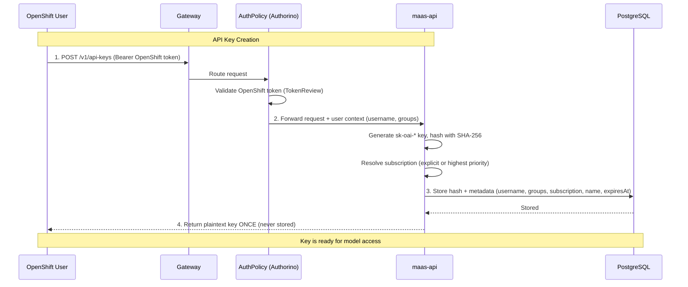
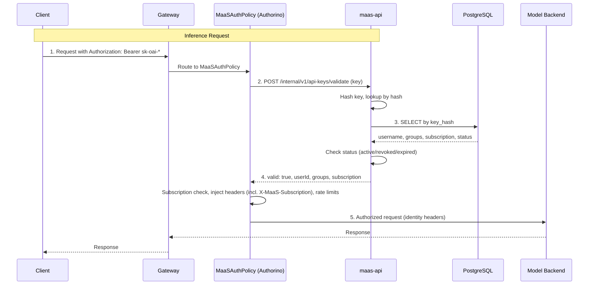
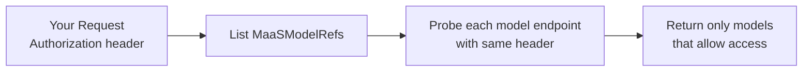

# Understanding Token Management

This guide explains the authentication and credential management used to access models in the MaaS Platform.

!!! tip "API keys (current)"
    The platform uses **API keys** (`sk-oai-*`) stored in PostgreSQL for programmatic access. Create keys via `POST /v1/api-keys` (authenticate with your OpenShift token) and use them with the `Authorization: Bearer` header. Each key is bound to one MaaSSubscription at creation time (optional `subscription` in the request body; if omitted, the **highest `spec.priority`** subscription you can access is chosen). See [Quota and Access Configuration](quota-and-access-configuration.md) and [Subscription Known Issues](subscription-known-issues.md).

!!! note "Prerequisites"
    This document assumes you have configured subscriptions (MaaSAuthPolicy, MaaSSubscription).
    See [Quota and Access Configuration](quota-and-access-configuration.md) for setup.

---

## Table of Contents

1. [Overview](#overview)
1. [How API Key Creation Works](#how-api-key-creation-works)
1. [How API Key Validation Works](#how-api-key-validation-works)
1. [Model Discovery](#model-discovery)
1. [Practical Usage](#practical-usage)
1. [API Key Lifecycle Management](#api-key-lifecycle-management)
1. [Frequently Asked Questions (FAQ)](#frequently-asked-questions-faq)
1. [Related Documentation](#related-documentation)

---

## Overview

The platform uses a secure, API key–based authentication system. You authenticate with your OpenShift credentials to create long-lived API keys, which are stored as SHA-256 hashes in a PostgreSQL database. This approach provides several key benefits:

- **Long-Lived Credentials**: API keys remain valid until you revoke them or they expire (configurable), unlike short-lived Kubernetes tokens.
- **Subscription-Based Access Control**: Keys inherit your group membership at creation time; the gateway uses these groups for subscription lookup and rate limits.
- **Auditability**: Every request is tied to a specific key and identity; `last_used_at` tracks usage.
- **Show-Once Security**: The plaintext key is returned only at creation; only the hash is stored.

The process is simple:

```text
Authenticate with OpenShift → Create an API key via POST /v1/api-keys → Use the key with Authorization: Bearer for model access
```

---

## How API Key Creation Works

When you create an API key, you trade your OpenShift identity for a long-lived credential that can be used for programmatic access.

### Key Concepts

- **Subscription binding**: Each key stores a MaaSSubscription name resolved at mint time. You can set it explicitly with the optional JSON field `subscription` on `POST /v1/api-keys`. If you omit it, the API selects your **highest-priority** accessible subscription (ties break deterministically—see operator notes below).
- **Subscription access**: Your access is still determined by MaaSAuthPolicy and MaaSSubscription, which map groups to models and rate limits. The bound name is used for gateway subscription resolution and metering.
- **User Groups**: At creation time, your current group membership is stored with the key. These groups are used for subscription-based authorization when the key is validated.
- **API Key**: A cryptographically secure string with `sk-oai-*` prefix. The plaintext is shown once; only the SHA-256 hash is stored in PostgreSQL.
- **Expiration**: Keys have a configurable TTL via `expiresIn` (e.g., `30d`, `90d`, `1h`). If omitted, the key defaults to the configured maximum (e.g., 90 days).

The create response includes a `subscription` field echoing the bound subscription name.

### API Key Creation Flow

This diagram illustrates the process of creating an API key.



---

## How API Key Validation Works

When you use an API key for inference, the gateway validates it via the MaaS API before allowing the request.

### Validation Flow



The validation endpoint (`/internal/v1/api-keys/validate`) is called by Authorino on every request that bears an `sk-oai-*` token. It:

1. Hashes the incoming key and looks it up in the database
2. Returns `valid: true` with `userId`, `groups`, and `subscription` if the key is active and not expired
3. Returns `valid: false` with a reason if the key is invalid, revoked, or expired

---

## Model Discovery

The `/v1/models` endpoint allows you to discover which models you're authorized to access. This endpoint works with any valid authentication token — you can use your OpenShift token or an API key.

### How It Works

When you call **GET /v1/models** with an **Authorization** header, the API passes that header **as-is** to each model's `/v1/models` endpoint to validate access. Only models that return 2xx or 405 are included in the list. No token exchange or modification is performed; the same header you send is used for the probe.



This means you can:

1. **Authenticate with OpenShift or OIDC** — use your existing identity and the same token you would use for inference.
2. **Use an API key** — use your `sk-oai-*` key in the Authorization header.
3. **Call `/v1/models` immediately** — see only the models you can access, without creating an API key first (if using OpenShift token).

---

## Practical Usage

For step-by-step instructions on obtaining and using API keys to access models, including practical examples and troubleshooting, see the [Self-Service Model Access Guide](../user-guide/self-service-model-access.md).

That guide provides:

- Complete walkthrough for getting your OpenShift token
- How to create an API key via `POST /v1/api-keys`
- Examples of making inference requests with your API key
- Troubleshooting common authentication issues

---

## API Key Lifecycle Management

API keys are long-lived by default but support expiration and revocation.

### Key Expiration

Keys have a configurable TTL:

- **Default**: Omit `expiresIn` in the create request; the key uses the configured maximum (e.g., 90 days).
- **Custom TTL**: Set `expiresIn` when creating (e.g., `"90d"`, `"30d"`, `"1h"`). The response includes `expiresAt` (RFC3339).

When a key expires, validation returns `valid: false` with reason `"key revoked or expired"`. Create a new key to continue.

### Key Revocation

**Revoke a single key:** Send a `DELETE` request to `/v1/api-keys/:id`.

```bash
curl -sSk -X DELETE "${MAAS_API_URL}/maas-api/v1/api-keys/${KEY_ID}" \
  -H "Authorization: Bearer $(oc whoami -t)"
```

**Bulk revoke all keys for a user:** Send a `POST` request to `/v1/api-keys/bulk-revoke`.

```bash
curl -sSk -X POST "${MAAS_API_URL}/maas-api/v1/api-keys/bulk-revoke" \
  -H "Authorization: Bearer $(oc whoami -t)" \
  -H "Content-Type: application/json" \
  -d '{"username": "alice"}'
```

Revocation updates the key status to `revoked` in the database. The next validation request will reject the key. Authorino may cache validation results briefly; revocation is effective as soon as the cache expires.

!!! warning "Important"
    **For Platform Administrators**: Admins can revoke any user's keys via `DELETE /v1/api-keys/:id` (if they own or have admin access) or `POST /v1/api-keys/bulk-revoke` with the target username. This is an effective way to immediately cut off access for a specific user in response to a security event.

---

## Frequently Asked Questions (FAQ)

**Q: My subscription access is wrong. How do I fix it?**

A: Your access is determined by your group membership in OpenShift at the time the API key was created. Those groups are stored with the key and used for authorization. The subscription name on the key is fixed at mint time; to use a different subscription, create another key with `"subscription": "<name>"`. If your groups have changed, create a new API key to pick up the new membership.

---

**Q: What if two MaaSSubscriptions use the same `spec.priority`?**

A: API key mint and subscription selection use a deterministic order when priorities tie (e.g. token limit, then name). Operators should still assign distinct priorities when possible. The MaaSSubscription controller sets status condition `SpecPriorityDuplicate` and logs when another subscription shares the same priority—use that to clean up configuration.

---

**Q: How long should my API keys be valid for?**

A: For interactive use or long-running integrations, keys with long TTL (e.g., 90d) or the default maximum are common. For higher security, use shorter TTLs (e.g., 30d) and rotate keys periodically.

---

**Q: Can I have multiple active API keys at once?**

A: Yes. Each call to `POST /v1/api-keys` creates a new, independent key. You can list and manage them via `POST /v1/api-keys/search` (with optional filters and pagination) or `GET /v1/api-keys/:id` for a specific key.

---

**Q: What happens if the maas-api service is down?**

A: You will not be able to create or validate API keys. Inference requests that use API keys will fail until the service is back.

---

**Q: Can I use one API key to access multiple different models?**

A: Yes. Your API key is bound to a subscription at creation time. If that subscription provides access to multiple models, a single key works for all of them. To access models from a different subscription, create a new API key bound to that subscription.

---

**Q: What's the difference between my OpenShift token and an API key?**

A: Your **OpenShift token** is your identity token from authentication (e.g., OpenShift or OIDC). An **API key** is a long-lived credential created via `POST /v1/api-keys` and stored as a hash in PostgreSQL. For **GET /v1/models**, the API passes your Authorization header as-is to each model endpoint; you can use either. For inference, use API key.

---

**Q: Do I need an API key to list available models?**

A: No. Call **GET /v1/models** with your OpenShift/OIDC token (or an API key) in the Authorization header. The API uses that same header to probe each model endpoint and returns only models you can access.

---

**Q: Where is my API key stored?**

A: Only the SHA-256 hash of your key is stored in PostgreSQL. The plaintext key is returned once at creation and is never stored. If you lose it, you must create a new key.

---

## Related Documentation

- **[Quota and Access Configuration](quota-and-access-configuration.md)**: For operators - subscription setup, access control, and rate limiting
- **[Self-Service Model Access](../user-guide/self-service-model-access.md)**: Step-by-step guide for creating and using API keys

---
